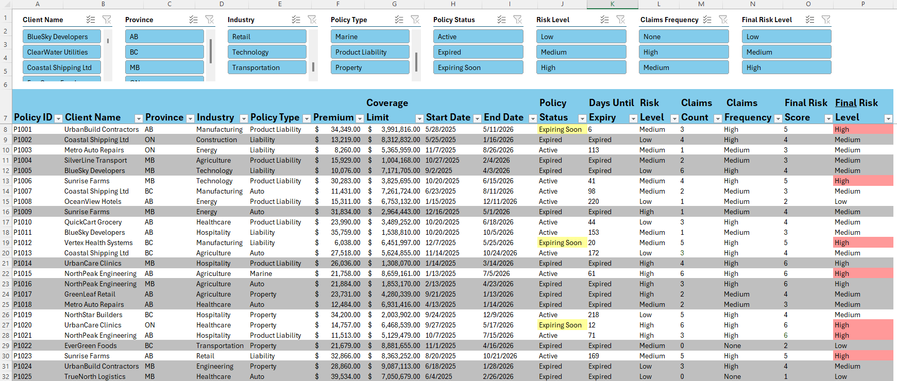
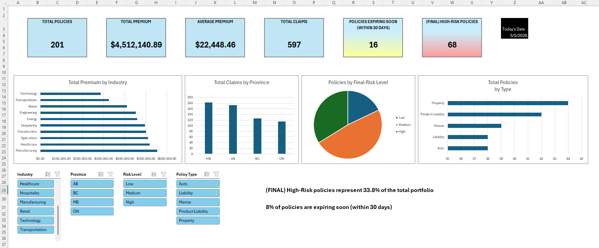
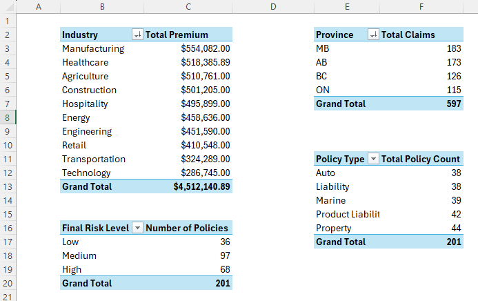

# underwriting-Excel-project

## Overview

I built a dynamically updating underwriting portfolio workbook that tracks individual policy risk, portfolio risk distribution, claims activity and renewal urgency using Excel dashboards, PivotTables, PivotCharts, conditional logic, data validation, and underwriting scoring models. 

This workbook contains multiple worksheets used to organize, analyze, and summarize insurance-related data using Excel formulas, reporting tools, and data analysis techniques.

## Skills Demonstrated

- PivotTables and PivotCharts
- Conditional formatting/logic
- Data validation
- Data Cleaning
- Reporting
- Insurance Data Analysis

## Workbook Structure

### “Policy Table” sheet

- The slicers at the top allow you to filter the table based on many of the column headers 
- The “Premium”, “Coverage Limit”, and “Claims Count” columns all have data validation, and will not allow negative numbers to be entered
- The “End Date” column has data validation, and will not allow a date to be entered that’s earlier than the “Start Date” to it’s left

Days Until Expiry (column K)
- This was calculated by taking the “End Date” and subtracting “Today’s date” which is found in cell AA4 in the sheet “Dashboard”
-	If the number of days until expiry is 0 or less, it will instead display “Expired”

Policy Status (column J)
-	If the number of days until expiry is 31 or more days, it will display “Active”
-	If the number of days until expiry is between 1 and 30 days inclusive, it will display “Expiring Soon”, and the cell will be highlighted yellow
-	If the number of days until expiry shows “Expired”, it will also display “Expired”, and thus the entire row of that policy will be highlighted grey 

Risk Level (column L)
-	The values currently in the sheet were randomly generated with a formula and then converted into text
-	The entire column has data validation in list form, allowing any cell to be changed to either “Low”, “Medium”, or “High”, as well as for a any new row that’s added
-	The “Final Risk Level” column (P) is calculated using both this and other factors in the sheet

Claims Count (column M)
-	This was randomly generated and then converted into standalone numbers without any formula 

Claims Frequency (column N)
-	If “Claims Count” is 3 or more, “Claims Frequency” will show “High”
-	If “Claims Count” is 1 or 2 more, “Claims Frequency” will show “Medium”
-	If “Claims Count” is 0, “Claims Frequency” will show “None”

Final Risk Score (column O)
-	Is a sum of a hidden risk level score and hidden claims frequency score 
-	The hidden risk level score is 3, 2, or 1 based on if “Risk Level” (column L) is “High”, “Medium”, or “Low” respectively
-	The hidden claims count score is 3 if “Claims Frequency” (column N) is “High”, is 1 if “Claims Frequency” is “Medium”, and is 0 if “Claims Frequency” is “None”

Final Risk Level (column P)
-	Is “High” if “Final Risk Score” is 5 or more, and the cell will be shaded red
-	Is “Medium” if “Final Risk Score” is 3 or 4
-	Is “Low” if “Final Risk Score” is 2 or less

### add policy table screenshot 

--------------------------------
### “Dashboard” sheet

-	If a new policy was added to the “Policy Table” sheet, click on any of the pivot charts, go “PivotChart Analyze” at the top, and hit refresh
-	This will update all the PivotCharts (and PivotTables) to include this new insurance policy
-	Do this as well when a policy is conversely removed from the “Policy Table” sheet

“POLICIES EXPIRING SOON (WITHIN 30 DAYS)”
-	Counts the total such policies on the “Policy Table” sheet
-	If the number is 10 or less, it will be shaded the same blue as rest of box 
-	If number is between 11 and 25, it will be shaded yellow 
-	If number is 26 or more, it will be shaded red

“(FINAL) HIGH-RISK POLICIES”
-	Counts the total such policies on the “Policy Table” sheet
-	If the number is 20 or less, it will be shaded the same blue as rest of box 
-	If number is between 21 and 40, it will be shaded yellow 
-	If number is 41 or more, it will be shaded red

OTHER AREAS
-	”Todays Date” in the upper right is the date that the spreadsheet views as the current day
-	Changing it will alter the “Policy Table” sheet, as it influences the “Days Until Expiry” of each policy, and thus also the “Policy Status” and which policies are treated as “Expired”
-	Changing it will also affect the “POLICIES EXPIRING SOON (WITHIN 30 DAYS)” box on this sheet

-	Each of the 4 slicers in the bottom left are connected to all 4 of the pivot charts

-	Both statements to the right of the slicers are dynamic, in that parts of them can/will change as the “Policy Table” sheet changes

### Dashboard screenshotttttttttttt

--------------------------------
### “PivotTables” and “KPI calculations” sheets 

-	These contain the PivotTables, formulas, and calculations needed to populate the items on the “Dashboard” sheet
-	The “KPI’s” page contains the array for data validation on the “Risk Level” column on the “Policy Table” sheet

### Sheet 2
Brief description.

### Sheet 3
Brief description.

### KPI calculations

### PivotTables

## Viewing the Workbook

To interact with the workbook:

1. Open the Excel file in this repository.
2. Download the workbook.
3. Open it using Microsoft Excel.

## About

Created as a portfolio project to demonstrate Excel and analytical skills relevant to underwriting and insurance operations.
